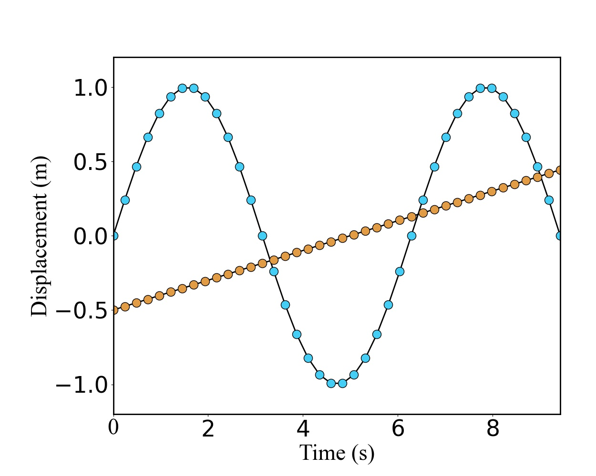

# Introduction

This repositories includes some batch processing codes and data visualization methods for Optic Remote Sensing. 

- **Remote Sensing**
  - [Acolite](https://github.com/acolite/acolite) (software for processing Landsat/ Sentinel) batch process in Windows
  - Batch run [Seadas](https://seadas.gsfc.nasa.gov/downloads/#CommandLineConfig) L2gen code in Linux environment
  - crop image code in python
  - Date calculation
  - Load Modis satellite data
- **Figures**
  - density_figure
  - [Picture beautification settings](/Figures/figure_setting_example.py)
- **Data procedure**
  - Excel file read/save
  - pandas merge
  - .nc file save
  - string list type transform
  - filter_list (filter list to a new list)
  - ...

### [Picture beautification settings](/Figures/figure_setting_example.py)